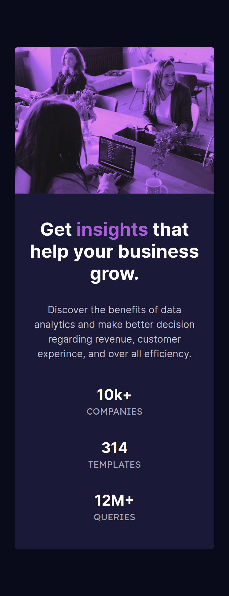

# Frontend Mentor - Stats preview card component solution

This is a solution to the [Stats preview card component challenge on Frontend Mentor](https://www.frontendmentor.io/challenges/stats-preview-card-component-8JqbgoU62). Frontend Mentor challenges help you improve your coding skills by building realistic projects. 

## Table of contents

- [Overview](#overview)
  - [The challenge](#the-challenge)
  - [Screenshot](#screenshot)
  - [Links](#links)
- [My process](#my-process)
  - [Built with](#built-with)
- [Author](#author)

## Overview

### The challenge

Users should be able to:

- View the optimal layout depending on their device's screen size

### Screenshot

| Dekstop View                                                          | Moblie View                                                         |
| ------------------------------------------------------------------- | ----------------------------------------------------------------- |
|                        |                        |
### Links

- Solution URL: [github](https://github.com/majidzahedi/stats-preview-card-component-main)
- Live Site URL: [netlify](https://62d19903a9a73842b5335972--sparkly-sunflower-d47312.netlify.app/)

## My process

### Built with

- Flexbox
- [TailwindCSS](http://tailwindcss.com/) - For styles

## Author

- Frontend Mentor - [@majidzahedi](https://www.frontendmentor.io/profile/majidzahedi)

